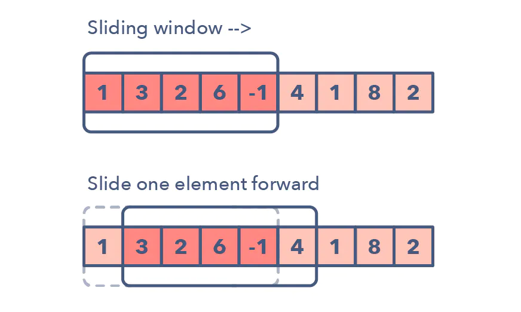

<!--
*** Thanks for checking out the Best-README-Template. If you have a suggestion
*** that would make this better, please fork the repo and create a pull request
*** or simply open an issue with the tag "enhancement".
*** Thanks again! Now go create something AMAZING! :D
***
***
***
*** To avoid retyping too much info. Do a search and replace for the following:
*** jakearmijo, data-structures-and-algorithms, jakemij, armijojake@yahoo.com, Common Data Structures and Algorithms, Creating and exploring the common data structures and algorithms
-->


<!-- PROJECT SHIELDS -->
<!--
*** I'm using markdown "reference style" links for readability.
*** Reference links are enclosed in brackets [ ] instead of parentheses ( ).
*** See the bottom of this document for the declaration of the reference variables
*** for contributors-url, forks-url, etc. This is an optional, concise syntax you may use.
*** https://www.markdownguide.org/basic-syntax/#reference-style-links
-->
[![Contributors][contributors-shield]][contributors-url]
[![Forks][forks-shield]][forks-url]
[![Stargazers][stars-shield]][stars-url]
[![Issues][issues-shield]][issues-url]
[![MIT License][license-shield]][license-url]
[![LinkedIn][linkedin-shield]][linkedin-url]


<!-- PROJECT LOGO -->
<br />
<p align="center">
  <a href="https://github.com/jakearmijo/data-structures-and-algorithms">
    
  </a>

  <h3 align="center">Common Data Structures and Algorithms</h3>

  <p align="center">
    Creating and exploring the common data structures and algorithms
    <br />
    <a href="https://github.com/jakearmijo/data-structures-and-algorithms"><strong>Explore the docs »</strong></a>
    <br />
    <br />
    <a href="https://github.com/jakearmijo/data-structures-and-algorithms">View Demo</a>
    ·
    <a href="https://github.com/jakearmijo/data-structures-and-algorithms/issues">Report Bug</a>
    ·
    <a href="https://github.com/jakearmijo/data-structures-and-algorithms/issues">Request Feature</a>
  </p>
</p>


<!-- TABLE OF CONTENTS -->
<details open="open">
  <summary><h2 style="display: inline-block">Table of Contents</h2></summary>
  <ol>
    <li>
      <a href="#about-the-project">About The Project</a>
      <ul>
        <li><a href="#built-with">Built With</a></li>
      </ul>
    </li>
    <li>
      <a href="#getting-started">Getting Started</a>
      <ul>
        <li><a href="#prerequisites">Prerequisites</a></li>
        <li><a href="#installation">Installation</a></li>
      </ul>
    </li>
    <li><a href="#usage">Usage</a></li>
    <li><a href="#roadmap">Roadmap</a></li>
    <li><a href="#contributing">Contributing</a></li>
    <li><a href="#license">License</a></li>
    <li><a href="#contact">Contact</a></li>
    <li><a href="#acknowledgements">Acknowledgements</a></li>
  </ol>
</details>


<!-- ABOUT THE PROJECT -->
## About The Project

[![Common Data Structures and Algorithms][screenshot]](https://jakearmijo.com)

I started this to build common data structures and practice algorithims. This is a place I am keeping notes and documentation on topics.
What is an algorithm? **A process or set of steps to acomplish a certain task**
Foundation for being a successful problem solving and developing

## How to improve? Plans and Approaches

### Sliding Window

The Sliding Window pattern is used to perform a required operation on a specific window size of a given array or linked list, such as finding the longest subarray containing all 1s. Sliding Windows start from the 1st element and keep shifting right by one element and adjust the length of the window according to the problem that you are solving. In some cases, the window size remains constant and in other cases the sizes grows or shrinks.

#### Following are some ways you can identify that the given problem might require a sliding window:
 - The problem input is a linear data structure such as a linked list, array, or string 
 - You’re asked to find the longest/shortest substring, subarray, or a desired value

#### Common problems you use the sliding window pattern with:
- Maximum sum subarray of size ‘K’ (easy)
- Longest substring with ‘K’ distinct characters (medium)
- String anagrams (hard)

### Two Pointers or Iterators

Two Pointers is a pattern where two pointers iterate through the data structure in tandem until one or both of the pointers hit a certain condition.Two Pointers is often useful when searching pairs in a sorted array or linked list; for example, when you have to compare each element of an array to its other elements.

Two pointers are needed because with just pointer, you would have to continually loop back through the array to find the answer. This back and forth with a single iterator is inefficient for time and space complexity — a concept referred to as asymptotic analysis. While the brute force or naive solution with 1 pointer would work, it will produce something along the lines of O(n²). In many cases, two pointers can help you find a solution with better space or runtime complexity.

<!-- Frequency Counter -->
### Frequency Counter

This pattern uses object or sets to collect values/frequencies of values. This is an idea of creating a object and tracking values we come accross. We can then give them a value and increase or decrease it as needed.

### Prerequisites

This is an example of how to list things you need to use the software and how to install them.
* npm
  ```sh
  npm install npm@latest -g
  ```

### Installation

1. Clone the repo
   ```sh
   git clone https://github.com/jakearmijo/data-structures-and-algorithms.git
   ```
2. Install NPM packages
   ```sh
   npm install
   ```


<!-- USAGE EXAMPLES -->
## Usage

 to study, learn, and beyond

_For more examples, please refer to the [Documentation](https://jakearmijo.com)_


<!-- ROADMAP -->
## Roadmap

See the [open issues](https://github.com/jakearmijo/data-structures-and-algorithms/issues) for a list of proposed features (and known issues).


<!-- CONTRIBUTING -->
## Contributing

Contributions are what make the open source community such an amazing place to learn, inspire, and create. Any contributions you make are **greatly appreciated**.

1. Fork the Project
2. Create your Feature Branch (`git checkout -b feature/AmazingFeature`)
3. Commit your Changes (`git commit -m 'Add some AmazingFeature'`)
4. Push to the Branch (`git push origin feature/AmazingFeature`)
5. Open a Pull Request


<!-- LICENSE -->
## License

Distributed under the MIT License. See `LICENSE` for more information.


<!-- CONTACT -->
## Questions


## Array

- [ ] [Two Sum](https://leetcode.com/problems/two-sum/)
- [ ] [Best Time to Buy and Sell Stock](https://leetcode.com/problems/best-time-to-buy-and-sell-stock/)
- [ ] [Contains Duplicate](https://leetcode.com/problems/contains-duplicate/)
- [ ] [Product of Array Except Self](https://leetcode.com/problems/product-of-array-except-self/)
- [ ] [Maximum Subarray](https://leetcode.com/problems/maximum-subarray/)
- [ ] [Maximum Product Subarray](https://leetcode.com/problems/maximum-product-subarray/)
- [ ] [Find Minimum in Rotated Sorted Array](https://leetcode.com/problems/find-minimum-in-rotated-sorted-array/)
- [ ] [Search in Rotated Sorted Array](https://leetcode.com/problems/search-in-rotated-sorted-array/)
- [ ] [3Sum](https://leetcode.com/problems/3sum/)
- [ ] [Container With Most Water](https://leetcode.com/problems/container-with-most-water/)

---

## Binary

- [ ] [Sum of Two Integers](https://leetcode.com/problems/sum-of-two-integers/)
- [ ] [Number of 1 Bits](https://leetcode.com/problems/number-of-1-bits/)
- [ ] [Counting Bits](https://leetcode.com/problems/counting-bits/)
- [ ] [Missing Number](https://leetcode.com/problems/missing-number/)
- [ ] [Reverse Bits](https://leetcode.com/problems/reverse-bits/)

---

## Dynamic Programming

- [ ] [Climbing Stairs](https://leetcode.com/problems/climbing-stairs/)
- [ ] [Coin Change](https://leetcode.com/problems/coin-change/)
- [ ] [Longest Increasing Subsequence](https://leetcode.com/problems/longest-increasing-subsequence/)
- [ ] [Longest Common Subsequence](https://leetcode.com/problems/longest-common-subsequence/)
- [ ] [Word Break Problem](https://leetcode.com/problems/word-break/)
- [ ] [Combination Sum](https://leetcode.com/problems/combination-sum-iv/)
- [ ] [House Robber](https://leetcode.com/problems/house-robber/)
- [ ] [House Robber II](https://leetcode.com/problems/house-robber-ii/)
- [ ] [Decode Ways](https://leetcode.com/problems/decode-ways/)
- [ ] [Unique Paths](https://leetcode.com/problems/unique-paths/)
- [ ] [Jump Game](https://leetcode.com/problems/jump-game/)

---

## Graph

- [ ] [Clone Graph](https://leetcode.com/problems/clone-graph/)
- [ ] [Course Schedule](https://leetcode.com/problems/course-schedule/)
- [ ] [Pacific Atlantic Water Flow](https://leetcode.com/problems/pacific-atlantic-water-flow/)
- [ ] [Number of Islands](https://leetcode.com/problems/number-of-islands/)
- [ ] [Longest Consecutive Sequence](https://leetcode.com/problems/longest-consecutive-sequence/)
- [ ] [Alien Dictionary (Leetcode Premium)](https://leetcode.com/problems/alien-dictionary/)
- [ ] [Graph Valid Tree (Leetcode Premium)](https://leetcode.com/problems/graph-valid-tree/)
- [ ] [Number of Connected Components in an Undirected Graph (Leetcode Premium)](https://leetcode.com/problems/number-of-connected-components-in-an-undirected-graph/)

---

## Interval

- [ ] [Insert Interval](https://leetcode.com/problems/insert-interval/)
- [ ] [Merge Intervals](https://leetcode.com/problems/merge-intervals/)
- [ ] [Non-overlapping Intervals](https://leetcode.com/problems/non-overlapping-intervals/)
- [ ] [Meeting Rooms (Leetcode Premium)](https://leetcode.com/problems/meeting-rooms/)
- [ ] [Meeting Rooms II (Leetcode Premium)](https://leetcode.com/problems/meeting-rooms-ii/)

---

## Linked List

- [ ] [Reverse a Linked List](https://leetcode.com/problems/reverse-linked-list/)
- [ ] [Detect Cycle in a Linked List](https://leetcode.com/problems/linked-list-cycle/)
- [ ] [Merge Two Sorted Lists](https://leetcode.com/problems/merge-two-sorted-lists/)
- [ ] [Merge K Sorted Lists](https://leetcode.com/problems/merge-k-sorted-lists/)
- [ ] [Remove Nth Node From End Of List](https://leetcode.com/problems/remove-nth-node-from-end-of-list/)
- [ ] [Reorder List](https://leetcode.com/problems/reorder-list/)

---

## Matrix

- [ ] [Set Matrix Zeroes](https://leetcode.com/problems/set-matrix-zeroes/)
- [ ] [Spiral Matrix](https://leetcode.com/problems/spiral-matrix/)
- [ ] [Rotate Image](https://leetcode.com/problems/rotate-image/)
- [ ] [Word Search](https://leetcode.com/problems/word-search/)

---

## String

- [ ] [Longest Substring Without Repeating Characters](https://leetcode.com/problems/longest-substring-without-repeating-characters/)
- [ ] [Longest Repeating Character Replacement](https://leetcode.com/problems/longest-repeating-character-replacement/)
- [ ] [Minimum Window Substring](https://leetcode.com/problems/minimum-window-substring/)
- [ ] [Valid Anagram](https://leetcode.com/problems/valid-anagram/)
- [ ] [Group Anagrams](https://leetcode.com/problems/group-anagrams/)
- [ ] [Valid Parentheses](https://leetcode.com/problems/valid-parentheses/)
- [ ] [Valid Palindrome](https://leetcode.com/problems/valid-palindrome/)
- [ ] [Longest Palindromic Substring](https://leetcode.com/problems/longest-palindromic-substring/)
- [ ] [Palindromic Substrings](https://leetcode.com/problems/palindromic-substrings/)
- [ ] [Encode and Decode Strings (Leetcode Premium)](https://leetcode.com/problems/encode-and-decode-strings/)

---

## Tree
- [ ] [Maximum Depth of Binary Tree](https://leetcode.com/problems/maximum-depth-of-binary-tree/)
- [ ] [Same Tree](https://leetcode.com/problems/same-tree/)
- [ ] [Invert/Flip Binary Tree](https://leetcode.com/problems/invert-binary-tree/)
- [ ] [Binary Tree Maximum Path Sum](https://leetcode.com/problems/binary-tree-maximum-path-sum/)
- [ ] [Binary Tree Level Order Traversal](https://leetcode.com/problems/binary-tree-level-order-traversal/)
- [ ] [Serialize and Deserialize Binary Tree](https://leetcode.com/problems/serialize-and-deserialize-binary-tree/)
- [ ] [Subtree of Another Tree](https://leetcode.com/problems/subtree-of-another-tree/)
- [ ] [Construct Binary Tree from Preorder and Inorder Traversal](https://leetcode.com/problems/construct-binary-tree-from-preorder-and-inorder-traversal/)
- [ ] [Validate Binary Search Tree](https://leetcode.com/problems/validate-binary-search-tree/)
- [ ] [Kth Smallest Element in a BST](https://leetcode.com/problems/kth-smallest-element-in-a-bst/)
- [ ] [Lowest Common Ancestor of BST](https://leetcode.com/problems/lowest-common-ancestor-of-a-binary-search-tree/)
- [ ] [Implement Trie (Prefix Tree)](https://leetcode.com/problems/implement-trie-prefix-tree/)
- [ ] [Add and Search Word](https://leetcode.com/problems/add-and-search-word-data-structure-design/)
- [ ] [Word Search II](https://leetcode.com/problems/word-search-ii/)

---

## Heap

- [ ] [Merge K Sorted Lists](https://leetcode.com/problems/merge-k-sorted-lists/)
- [ ] [Top K Frequent Elements](https://leetcode.com/problems/top-k-frequent-elements/)
- [ ] [Find Median from Data Stream](https://leetcode.com/problems/find-median-from-data-stream/)

## Important Link:
[14 Patterns to Ace Any Coding Interview Question](https://hackernoon.com/14-patterns-to-ace-any-coding-interview-question-c5bb3357f6ed)


<!-- ACKNOWLEDGEMENTS -->
## Acknowledgements

* [14-patterns-to-ace-any-coding-interview-question](https://hackernoon.com/14-patterns-to-ace-any-coding-interview-question-c5bb3357f6ed)
* [neetcode](https://neetcode.io/)
* [Grind75](https://www.techinterviewhandbook.org/grind75)


<!-- MARKDOWN LINKS & IMAGES -->
<!-- https://www.markdownguide.org/basic-syntax/#reference-style-links -->
[contributors-shield]: https://img.shields.io/github/contributors/jakearmijo/repo.svg?style=for-the-badge
[contributors-url]: https://github.com/jakearmijo/data-structures-and-algorithms/graphs/contributors
[forks-shield]: https://img.shields.io/github/forks/jakearmijo/repo.svg?style=for-the-badge
[forks-url]: https://github.com/jakearmijo/data-structures-and-algorithms/network/members
[stars-shield]: https://img.shields.io/github/stars/jakearmijo/repo.svg?style=for-the-badge
[stars-url]: https://github.com/jakearmijo/data-structures-and-algorithms/stargazers
[issues-shield]: https://img.shields.io/github/issues/jakearmijo/repo.svg?style=for-the-badge
[issues-url]: https://github.com/jakearmijo/data-structures-and-algorithms/issues
[license-shield]: https://img.shields.io/github/license/jakearmijo/repo.svg?style=for-the-badge
[license-url]: https://github.com/jakearmijo/data-structures-and-algorithms/blob/master/LICENSE.txt
[linkedin-shield]: https://img.shields.io/badge/-LinkedIn-black.svg?style=for-the-badge&logo=linkedin&colorB=555
[linkedin-url]: https://linkedin.com/in/jakearmijo
